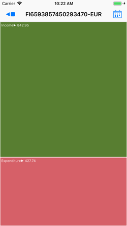
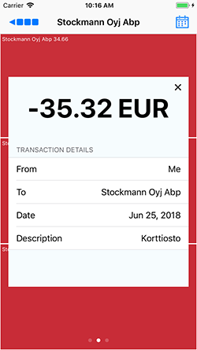
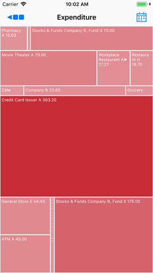

# ExamineSpending iOS App

Simple iOS application demo project that uses two Finnish banks' Open Banking interfaces (Nordea and OP) for visualising  accounts and transactions in a treemap view. ExamineSpending uses API sandbox data, i.e. it cannot be used to view real live account information. In the Nordea Sandbox, it is possible to generate your own test accounts and transactions for testing different scenarios.

  

## Getting Started

To build this app and run it in simulator/device you will need to register to the [Nordea Developer Portal](https://developer.nordeaopenbanking.com/) and [OP Developer Portal](https://op-developer.fi/) for obtaining your own API keys. 

ExamineSpending application is built for [Nordea Accounts API V2](https://developer.nordeaopenbanking.com/app/documentation?api=Accounts%20API&version=2.0) and [OP Accounts API V2](https://op-developer.fi/docs/api/6mU2J4ZntSISWMiOmueYKG/Accounts-2.0). 

Once you have the keys, you can add them to the bank-specific request adapter files. Once you've cloned the repository, you'll find the slots for typing in your API keys in *NordeaRequestAdapter.swift* and *OPRequestAdapter.swift* respectively.

After this, you can build and run the app. You can log in to either Nordea or OP sandbox from the starting page.

**OP** API has hardcoded authentication token, you can switch between a handful of tokens in the *OPRequestAdapter.swift* file

**Nordea** API uses OAuth style authentication where you can either run without UI, or with a simulated OAuth flow. See below for details on that. Only the Finnish Nordea API v2.1 is currently supported in the app.

##### Nordea Simulated OAuth flow
Nordea Open Banking API console (https://developer.nordeaopenbanking.com/app/console) is still not working and this has also rendered the OAuth simulation unusable. Application still implements the flow  flow as it used to work in Nordea API console. You can test this, but currently no guarantees on it working:
1. Turn on the **Simulate OAuth Flow** switch on the login page.
2. Tap **Login To Nordea API** and wait until the web oauth page is displayed
3. Select **Mobile Offline?** to get the web oauth page to offline mode
4. Type any seven (7) digits in **Login ID** field
5. On the **Code from Codes App** field, type 111111 (six times 1)
6. Tap **Login Using Offline Code**
7. You'll get a standard cookie warning, and a Terms & Conditions page if signing in with the given Login Id for the first time. Just accept those to get past.
8. On the Account selection screen, you can select which accounts to grant access to. Note that only the account with id **FI6593857450293470** will have a readable balance, and if you don't select that, you won't see any data on after login.

### Dependencies

ExamineSpending uses the following third party components:
* [AlamoFire](https://github.com/Alamofire/Alamofire) for network communications
* [SwiftyBeaver](https://github.com/SwiftyBeaver/SwiftyBeaver) for logging
* [YMTreeMap](https://github.com/yahoo/YMTreeMap) for the treemap view generation 
* [SwiftLint](https://github.com/realm/SwiftLint) (optional) ExamineSpending project has a SwiftLint configuration file. If you don't have SwiftLint installed, the build will work but you will get a warning.

The dependencies are configured through CocoaPods and included in the repository for your convenience (except for SwiftLint, which you will need to install on your own).

## License

This project is licensed under the MIT License - see the [LICENSE](LICENSE) file for details

## Acknowledgments

* The application is built with [Clean Swift](https://github.com/Clean-Swift) templates by **Raymond Law**.

